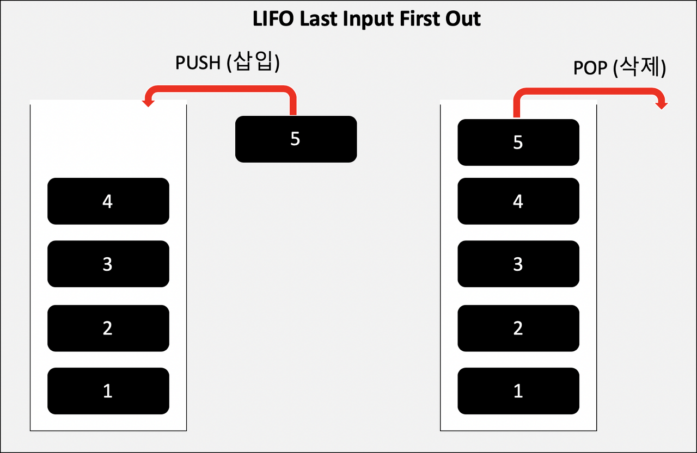
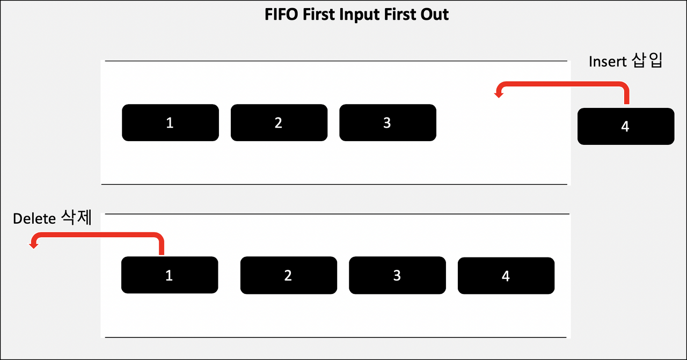

# 스택(Stack)

> 객체들의 집합소로써, 데이터를 기록하는 구조이다. 접근 방법은 후입선출(LIFO) 방식이다.

 

# 큐(Queue)

> 객체들의 집합소로써, 데이터를 기록하는 구조이다. stack과 반대 개념이며 접근 방법은 선입선출(FIFO) 방식이다.

 

## Stack VS Queue

|       | 삽입 위치 | 삭제 위치 |
| :---: | :-------: | :-------: |
| Stack |    top    |    top    |
| Queue |   rear    |   front   |
