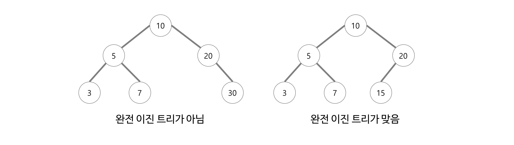

# 트리(Tree)

> 노드(node)로 이루어진 비선형 자료구조로 계층적 관계(Hierarchical Relationship)를 표현한다.

- 트리(Tree)의 특징

* 트리는 하나의 루트 노드를 갖는다.
* 모든 자식 노드는 한 개의 부모 노드만을 가진다.
* 노드가 N개인 트리는 항상 N - 1개의 간선(edge)을 가진다. (정점의 개수 - 1)
* 루트에서 어떤 노드로 가는 경로는 유일하다.
* 노드(node)와 노드는 간선(edge)으로 연결되어 있다.
* 트리에는 사이클(cycle)이 존재할 수 없다.
* 각 노드는 부모 노드로의 연결이 있을 수도 있고 없을 수도 있다.
* 각 노드는 어떤 자료형으로도 표현이 가능하다.
* 트리는 그래프의 한 종류이다.
  - 사이클(cycle)이 없는 하나의 연결 그래프(Connected Graph) 또는 DAG(Directed Acyclic Graph, 방향성이 있는 비순환 그래프)의 한 종류로 볼 수 있다.

- 트리(Tree)와 관련된 용어
  

  - Root : 부모가 없는 노드, 트리는 하나의 루트 노드만을 가진다.
  - Leaf node : 자식이 없는 노드, '단말 노드' 또는 '말단 노드'라고 부른다.
  - edge : 간선, 노드간을 연결하는 선을 말한다.
  - internal node : 단말 노드가 아닌 노드, '내부 노드'라고 부른다.
  - sibling : 형제로, 같은 부모를 가지는 노드를 말한다.
  - size : 노드의 크기, 자신을 포함한 모든 자손 노드의 개수
  - depth : 노드의 깊이, 루트에서 어떤 노드에 도달하기 위해 거쳐야 하는 간선의 수
  - level : 노드의 레벨, 트리의 특정 깊이를 가지는 노드의 집합을 말한다.
  - degree : 노드의 차수, 하위 트리의 개수 / 간선 수(degree) = 각 노드가 지닌 가지의 수
  - degree of tree : 트리의 최대 차수
  - height : 트리의 높이, 루트 노드에서 가장 깊숙이 있는 노드의 깊이

 

## 이진 트리(Binary Tree)

> 각 노드가 최대 두 개의 자식을 갖는 트리이다.

  
  - 포화 이진 트리(Full Binary Tree) : 모든 레벨이 꽉 찬 이진 트리를 가리켜 포화 이진 트리라고 한다.
  
  - 완전 이진 트리(Complete Binary Tree) : 위에서 아래로, 왼쪽에서 오른쪽으로 순서대로 차곡차곡 채워진 이진 트리를 가리켜 완전 이진 트리라고 한다.

 

## 이진 탐색 트리(Binary Search Tree)

> 모든 노드가 아래와 같은 특정 순서를 따르는 속성이 있는 이진 트리

- 이진 탐색 트리에 데이터를 저장하는 규칙

  - 이진 탐색 트리의 노드에 저장된 키는 유일하다.
  - 루트 노드의 키가 왼쪽 서브 트리를 구성하는 어떠한 노드의 키보다 크다.
  - 루트 노드의 키가 오른쪽 서브 트리를 구성하는 어떠한 노드의 키보다 작다.
  - 왼쪽과 오른쪽 서브트리도 이진 탐색 트리이다.

- 이진 탐색 트리의 탐색 연산은 O(log n)의 시간 복잡도를 갖는다. 하지만 저장 순서에 따라 계속 한쪽으로만 노드가 추가되는 경우 편향 트리(Skewed Tree)가 될 수 있으며 이런 Worst Case의 경우 시간 복잡도는 O(n)이 된다.

 

## 레드 블랙 트리(Red Black Tree)

> 이진 탐색 트리(Binary Search Tree)를 기반으로 하는 트리 형식의 자료구조이다.

- BST(Binary Search Tree)를 기반으로 하므로 BST의 특징을 모두 갖는다.
- 이진 탐색 트리에서 저장 순서에 따라 한쪽으로만 노드가 추가되는 경우가 발생하여 성능이 저하되는 비효율적인 상황을 해결하기 위해 트리의 균형을 재조정하는 Rebalancing 기법이 등장하였다. 레드 블랙 트리는 이 기법을 구현하였다.
- RBT(Red Black Tree)는 Search, Insert, Delete에 O(log n)의 시간 복잡도를 갖는다. 동일한 노드의 개수일 때, depth를 최소화하여 시간 복잡도를 줄이는 것이 핵심 아이디어다. (노드의 개수가 동일할 때 depth가 최소가 되는 경우는 완전 이진 트리(complete binary tree)인 경우이다.)

* Red Black Tree의 규칙
  - 각 노드는 **Red** or **Black**이라는 색깔을 갖는다.
  - Root node의 색깔은 Black이다.
  - 어떤 노드의 색깔이 Red라면 두 개의 children의 색깔은 모두 Black이다.
  - 각 노드에 대해서 노드로부터 descendant leaves까지의 단순 경로는 모두 같은 수의 black nodes 들을 포함하고 있다. 이를 해당 노드의 Black-Height라고 한다.
  - 노드의 child가 없을 경우 child를 가리키는 포인터는 NIL 값을 저장한다. 이러한 NIL 들을 leaf node로 간주한다.

 

## 이진 힙(Binary Heap)

> 최댓값과 최솟값을 찾는 연산을 빠르게 하기 위해 고안된 완전 이진 트리(Complete Binary Tree)를 기본으로 한 자료구조이다.
