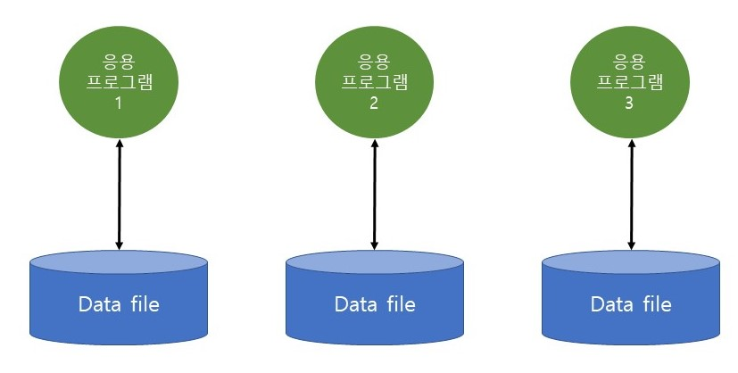
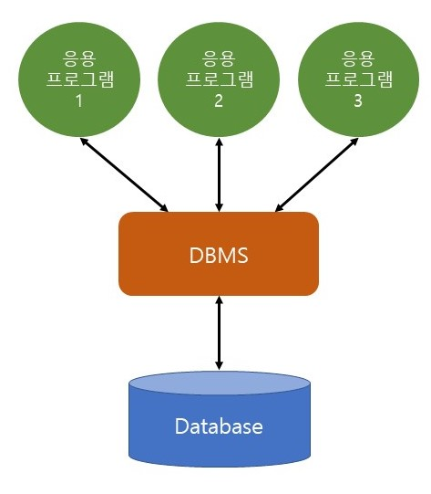

# 파일 시스템(File System)

> 각각의 응용 프로그램이 독립적으로 자료를 파일 형태로 배치하고 관리하는 데이터 처리 시스템이다.

### 장점

- 구현이 간편하다.
- 처리 속도가 데이터베이스 시스템에 비해 빠르다.

### 단점

- 데이터 종속성 : 데이터 파일과 응용프로그램이 1:1로 대응되는 특징을 가지고 있어 상호 간의 의존성이 높다. 따라서 데이터베이스의 구조, 접근 방법을 변경 시 프로그램도 같이 변경돼야 한다.
- 데이터 중복성
  1. 일관성 : 하나의 파일을 동시에 쓸 수 없음으로 여러 명이 작업할 때 공유가 불편하고 데이터 불일치 문제가 나타날 수 있다.
  2. 보안성 : 파일을 누구나 수정할 수 있음으로 보안이 떨어진다.
  3. 경제성 : 데이터 독립성이 없어 유지보수 비용이 크다.
  4. 무결성 : 데이터 무결성을 확보하기 어려우며 새로운 제약조건들을 추가하거나 기존의 제약조건을 수정하는 것이 어렵다.

 

# 데이터베이스 관리 시스템(DBMS, DataBase Management System)

> 데이터베이스를 응용 프로그램들이 직접 조작하는 것이 아니라 데이터베이스를 조작하는 별도의 소프트웨어가 있는데 이를 데이터베이스 관리 시스템이라 한다.

- 파일 시스템의 단점을 극복하고자 만들어졌다.

* 응용 프로그램들이 데이터베이스를 공유하여 사용할 수 있는 환경을 제공한다.
* 데이터베이스를 구축하는 틀을 제공하고, 효율적으로 데이터를 검색하고 저장하는 기능을 제공한다.
* 대표적인 데이터베이스 관리 시스템으로 Oracle, MY_SQL, MS_SQL 등이 있다.

 

### 특징

- 실시간 접근성 (Real Time Processing) : 의사 결정에 즉각 반영
- 계속적인 변화 (Continuous evolution) : 삽입, 삭제, 갱신 등 현재 최신의 상태 유지
- 동시 공용 (Concurrent Sharing) : 다수의 사용자가 동시에 접근, 이용 가능
- 내용에 의한 참조 (Content reference) : 실제 데이터값을 참조함

 

### 장점

- DBMS를 이용하여 데이터를 공유하기 때문에 중복 가능성이 낮다.
- 중복 제거로 데이터의 일관성이 유지된다.
- 데이터의 정의와 프로그램의 **독립성 유지**가 가능하다.
- 다양한 관리 기능을 제공해준다. (데이터의 복구, 보안, 동시성 제어 등)

### 단점

- 별도의 관리 인력 필요하다.
- 추가 도입 비용이 발생한다.
