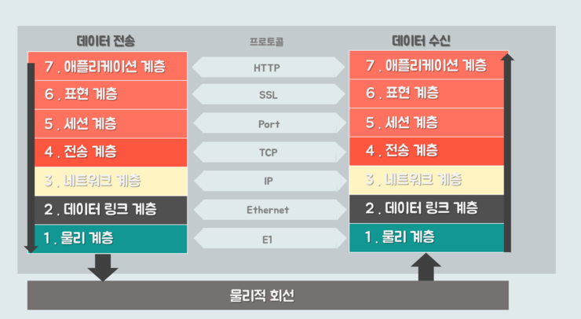

# OSI(Open System Interconnection) 7계층

> ISO(국제표준화기구)에서 통신이 일어나는 과정을 7단계로 구분하고 정의한 표준이다.

 

## OSI의 목적

- 통신이 일어나는 과정을 단계별로 파악할 수 있다.
- 7단계 중 특정한 곳에 이상이 생기면 다른 단계의 간섭 없이 이상이 생긴 단계만 고칠 수 있다.

 

## 계층 간 동작 원리

- 각 계층은 자신의 계층의 상위 또는 하위 계층과만 데이터를 주고받는 구조이다.
- 데이터 전송 시 7계층인 응용 계층부터 시작하여 전송되는 데이터에 단계별로 헤더가 추가되며, 데이터 수신 시엔 반대로 1계층인 물리 계층부터 시작해 데이터에 추가된 헤더들을 계층마다 검증하며 벗겨내는 구조이다.

 

## 1. 물리 계층(Physical Layer)

> 데이터를 전기적인 신호로 변환해서 주고받는 기능을 진행하는 공간이다.

- 물리적 매체를 통해 비트(Bit) 흐름을 전송하는 기능을 수행한다.

* 오직 데이터를 전송하는 역할만 한다.

- 허브, 리피터, 케이블 등이 있다.

 

## 2. 데이터 링크 계층(Data Link Layer)

> 물리 계층에서 송수신되는 정보의 오류와 흐름을 관리하여 신뢰성 있는 프레임(Frame)을 전달한다.

- 데이터 링크계층에서 부르는 데이터 단위는 프레임(Frame)이다.
- 데이터 전송은 Point-To-Point 간으로 이뤄진다.
- Mac 주소를 통해 통신하며, 프레임에 Mac 주소를 부여하고 에러 검출, 재전송, 흐름 제어를 진행한다.
- 스위치, 브리지 등이 있다.

 

## 3. 네트워크 계층(Network Layer)

> 목적지까지 가장 안전하고 빠르게 데이터를 보내는 기능(=라우팅 기능)을 수행한다.

- 네트워크 계층에서 부르는 데이터 단위는 패킷(Packet)이다.
- 라우터를 통해 이동할 경로를 선택하여 IP 주소를 지정하고, 해당 경로에 따라 패킷을 전달해준다.
- 라우터, IP

 

## 4. 전송 계층(Transport Layer)

> 양 끝단의 사용자들이 신뢰성 있는 데이터를 주고받게 해주는 역할을 합니다.

- 전송 계층에서 부르는 데이터 단위는 세그먼트(Segment)이다.
- 패킷 생성 및 오류 관리를 하며 전송되는 패킷이 유효한지 검증한다. 에러에 의해 전송 실패한 패킷을 재전송하는 기능도 수행한다.
- 데이터 전송을 위해 Port 번호가 사용된다.
- TCP, UDP
  - TCP : 신뢰성, 연결 지향적
  - UDP : 비신뢰성, 비연결성, 실시간
     

## 5. 세션 계층(Session Layer)

> 통신 세션을 관리한다.

- 사용자 간 연결 유지를 확인 및 관리하는 기능을 한다.
- TCP/IP 세션을 만들고 없애는 역할을 한다.

 

## 6. 표현 계층(Presentation Layer)

> 데이터 포맷, 암호화 및 복호화, 인코딩 등을 담당한다.

 

## 7. 응용 계층(Application Layer)

> 사용자와 가장 가까운 계층으로 응용 프로세스와 직접 관계하여 일반적인 응용 서비스를 수행한다.

- 사용자 인터페이스, 전자우편, 데이터베이스 관리 등의 서비스를 제공한다.
