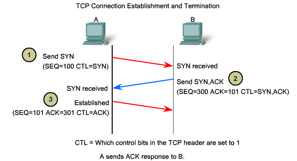
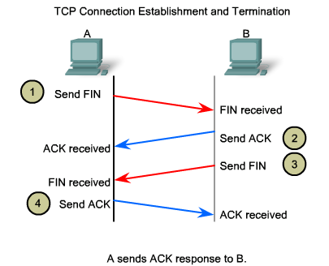

# TCP 3 Way-Handshake & 4 Way-Handshake

> 연결을 성립하고 해제하는 과정

## 3 Way-Handshake

> TCP는 장치들 사이에 논리적인 접속을 성립하기 위해 3 Way-Handshake를 사용한다.

- TCP/IP 프로토콜을 이용해 통신을 하는 응용프로그램이 정확한 전송을 보장하기 위해 데이터 전송 전에 상대방 컴퓨터와 사전에 세션을 수립하는 과정이다.
- 양쪽 모두 데이터를 전송할 준비가 되었다는 것을 보장하며, 데이터 전달이 시작하기 전 서로 준비가 되었는지를 알 수 있도록 한다.

1. 클라이언트(A)는 서버(B)에 접속을 요청하는 SYN 패킷을 보낸다. 이때 클라이언트는 SYN/ACK 응답을 기다리는 SYN_SENT 상태가 된다.
2. 서버는 SYN 요청을 받고 클라이언트에게 요청을 수락하는 ACK와 SYN flag가 설정된 패킷을 보낸다. 이때 서버는 클라이언트가 다시 ACK로 응답하기를 기다리며 SYN_RECEIVED 상태가 된다.
3. 클라이언트는 서버에게 ACK를 보내고 서버의 상태가 ESTABLISHED가 된다.

- 이렇게 3번의 통신을 통해 연결이 성립되기 때문에 3 Way-Handshake 이다.

 

## 4 Way-Handshake

> 통신이 끝난 후 연결을 해제하기 위해 4 Way-Handshake를 사용한다.

1. 클라이언트(A)는 연결을 종료하겠다는 FIN 플래그를 서버(B)에 전송한다.
2. 서버는 FIN을 받고 클라이언트에게 확인했다는 ACK를 보낸뒤 자신의 통신이 끝날때 까지 기다린다.(TIME OUT 상태)
3. 서버가 통신이 끝났다면 클라이언트에게 연결이 종료되었다는 FIN 플래그를 전송한다.
4. FIN을 받은 클라이언트는 확인했다는 ACK를 보낸다.
   > 이때 패킷이 유실이나 Routing지연으로 인한 재전송 등으로 FIN 패킷보다 늦게 도착하는 상황이 발생할 수 있는데, 이러한 패킷은 Drop되고 데이터는 유실될 것이다. 이러한 현상에 대비하여 클라이언트는 서버로부터 FIN을 수신하더라도 일정시간동안 세션을 남겨놓아 잉여 패킷을 기다린다. 이 과정을 TIME_WAIT라고 한다.
   >
   > - 서버는 ACK를 받고 소켓을 닫는다.
   > - TIME_WAIT 시간이 지나면 클라이언트도 닫는다.
