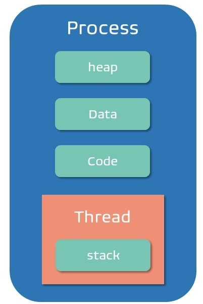

# 프로세스(Process)

> 실행 중인 프로그램으로 디스크로부터 메모리에 적재되어 운영체제의 제어를 받는 상태

## 특징

- 프로세스의 생성과 동시에 PCB가 생성된다.
- 프로세스는 기본적으로 최소 1개의 스레드를 가지고 있다.
- 각 프로세스는 별도의 주소 공간을 가지며, 서로 접근할 수 없다.
  - 서로 다른 프로세스에 접근하려면 프로세스 간의 통신(IPC)을 사용해야 한다.
- 호출된 함수의 복귀 주소, 지역 변수를 저장하는 **스택**과 프로세스의 실행 중 동적으로 할당되는 **힙**, 전역 변수들을 저장하며 읽고 쓰기가 가능한 **데이터 영역**, 프로세서가 실행하는 코드를 저장하는 **코드 영역**으로 이루어져 있다.

{: width="288" height="422"}

 

## 프로세스 제어 블록(PCB)

- 프로세스에 대한 정보를 저장하고 있는 운영체제의 자료구조이다.
- 프로세스의 식별자, 상태, 프로그램 카운터(프로세스를 수행하기 위한 다음 명령의 주소), 레지스터, 계정정보, 스케줄링, 메모리 관리 정보를 저장한다.
- 프로세스의 실행이 종료되면 같이 삭제된다.

 

## 프로세스 상태

- 생성(new) : 메인 메모리에 프로세스의 작업 공간이 생성되고, 프로세스의 정보를 관리하기 위한 PCB가 만들어지는 상태
- 준비(ready) : cpu외의 모든 자원을 할당받은 상태로 프로세서에 할당되기를 기다리는 상태
  - ready -> running (dispatching) : 준비 상태의 프로세스가 디스패처(dispatcher)에 의해 프로세서를 부여받아 실행상태가 된다.
- 실행(running) : 프로세서를 점유하여 실행되는 상태
  - running -> ready (time run out) : 특정 프로세스의 프로세서 독점을 방지하기 위해 인터럽트 클록을 두어 지정한 시간 동안만 프로세서를 점유하도록 한다. 스케줄러에 의해 문맥 교환(Context Switching)이 일어난 경우 프로세스는 준비 상태가 된다.
  - running -> blocked : 실행 중인 프로세스가 입출력 등의 이벤트가 필요할 경우 프로세스는 스스로 프로세서를 양도한다.
- 대기(blocked) : 프로세서가 입출력과 같은 이벤트가 일어나기를 기다리는 상태

  - blocked -> ready : 입출력이 끝나면 프로세스는 준비 상태가 된다.

- 종료(exit) : 프로세스의 수행이 끝난 상태

 

## 문맥 교환(Context Switching)

- CPU를 점유하고 있는 프로세서를 다른 프로세스로 전환하기 위해 진행하던 작업을 PCB에 저장하고, 새로운 프로세스의 레지스터를 적재하는 과정이다.
- 문맥 교환이 일어나는 동안은 작업을 수행할 수 없기 때문에 오버헤드(overhead)가 발생한다.
- 멀티 태스킹, 인터럽트 핸들링, 유저 모드와 커널 모드 간 전환 시 문맥 교환이 일어난다.

 

---

# 스레드(Thread)

> 프로세스 내에서 실행되는 여러 흐름의 단위로 경량 프로세스(LWP)라고도 한다.

## 특징

- 스레드는 별도의 레지스터와 스택을 가지고 있으며, 같은 프로세스에 속한 다른 스레드와 힙, 데이터, 코드 영역의 자원들을 공유한다.
  - 문맥 교환 시간이 짧다.
  - 스레드 간에 커널의 도움 없이 통신이 가능하다.

 

---

# 멀티 프로세스 vs 멀티 스레드

## 멀티 프로세스

> 여러 개의 프로세스가 하나의 응용프로그램을 처리하는 것

- ### 장점
  - 문제 발생 시 문제가 일어난 프로세스 외에는 영향이 없다.
- ### 단점
  - 프로세스는 각각 독립된 메모리 영역을 할당받았기 때문에 프로세스 간 공유하는 메모리가 없어 문맥 교환(Context Switching)이 잦으면 오버헤드(overhead)가 커진다.
  - 복잡한 프로세스 간의 통신(IPC)

 

## 멀티 스레드

> 여러 개의 스레드가 하나의 응용프로그램을 처리하는 것

- ### 장점
  > 멀티 프로세스 대신 멀티 스레드를 사용하는 이유
  - 같은 프로세스 내의 스레드들은 메모리를 공유하기 때문에 자원 소모가 적고 통신 비용을 절감할 수 있으며 프로그램의 응답 시간도 단축할 수 있다.
  - 프로세스를 생성하여 자원을 할당하는 시스템 콜이 줄어들어 자원을 효율적으로 관리할 수 있다.
- ### 단점
  - 스레드 간의 자원 공유 시 함께 상용할 때 동기화에 문제가 생길 수 있다.
  - 단일 프로세스를 가진 시스템의 경우 효과를 기대하기 어렵다.
